# VR射击训练游戏 UI 效果图与提示词整理

本文档整理本轮生成的 VR 射击训练游戏 DEMO UI 效果图。每个条目包含图片文件名、内容简述、效果图预览和对应可复用提示词。

所有图片均为 16:9 横版 UI 概念图，图片文件与本文档位于同一目录。

## 目录

| 序号 | 图片名称 | 内容简述 |
|---:|---|---|
| 1 | vr-shooting-training-ui-main.png | 通用视觉风格概念图 |
| 2 | vr-shooting-main-menu-ui.png | 游戏主界面 |
| 3 | vr-shooting-training-mode-selection-ui.png | 训练模式选择 |
| 4 | vr-shooting-100m-zeroing-briefing-ui.png | 100m射校靶任务说明 |
| 5 | vr-shooting-100m-zeroing-first-person-hud-ui.png | 100m射校靶第一人称射击 HUD |
| 6 | vr-shooting-100m-impact-analysis-ui.png | 100m射校靶本轮弹着分析 |
| 7 | vr-shooting-100m-final-rating-ui.png | 100m射校靶最终评级 |
| 8 | vr-shooting-moving-target-mode-settings-ui.png | 移动目标射击模式设置 |
| 9 | vr-shooting-moving-target-daytime-first-person-hud-ui.png | 移动目标射击白天 HUD |
| 10 | vr-shooting-moving-target-night-first-person-hud-ui.png | 移动目标射击夜晚 HUD |
| 11 | vr-shooting-moving-target-results-ui.png | 移动目标射击训练结算 |
| 12 | vr-shooting-trench-map-selection-ui.png | 堑壕射击地图选择 |
| 13 | vr-shooting-armory-weapon-wall-ui.png | 武器库 / 武器墙 |
| 14 | vr-shooting-trench-opening-briefing-ui.png | 堑壕射击开场任务简报 |
| 15 | vr-shooting-trench-first-person-hud-ui.png | 堑壕射击第一人称 HUD |
| 16 | vr-shooting-trench-teammate-command-radial-ui.png | 堑壕队友指令环形菜单 |
| 17 | vr-shooting-trench-results-ui.png | 堑壕射击任务结算 |
| 18 | vr-shooting-urban-map-selection-ui.png | 城镇攻防地图选择 |
| 19 | vr-shooting-urban-street-first-person-hud-ui.png | 城镇攻防街道 HUD |
| 20 | vr-shooting-urban-building-search-first-person-hud-ui.png | 城镇攻防建筑搜索 HUD |
| 21 | vr-shooting-urban-results-ui.png | 城镇攻防任务结算 |
| 22 | vr-shooting-settings-ui.png | 设置界面 |

## 1. 通用视觉风格概念图

**图片名称：** `vr-shooting-training-ui-main.png`

**内容简述：** 现代军事 VR 训练模拟器总体视觉风格，包含深色基地环境、青蓝全息 HUD、橙色强调信息，作为整套 UI 的风格母版。

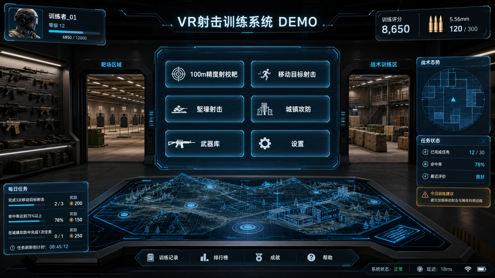

**提示词：**

```text
生成一张16:9横版VR射击训练游戏UI概念图，写实3D游戏画面结合未来感HUD界面，项目为DEMO原型，整体风格为现代军事训练模拟器，不血腥、不夸张、不使用真实军队徽章。UI采用深灰黑底、青蓝色全息线框、少量橙黄色警示色，界面清晰、专业、适合VR头显显示。中文界面文字尽量清晰可读，按钮和面板布局规整，像AAA游戏主界面/任务界面截图。不要水印，不要品牌logo。
```

## 2. 游戏主界面

**图片名称：** `vr-shooting-main-menu-ui.png`

**内容简述：** 训练基地大厅主菜单，中央标题“VR射击训练系统 DEMO”，右侧竖向模式入口，左下角玩家档案与训练信息。

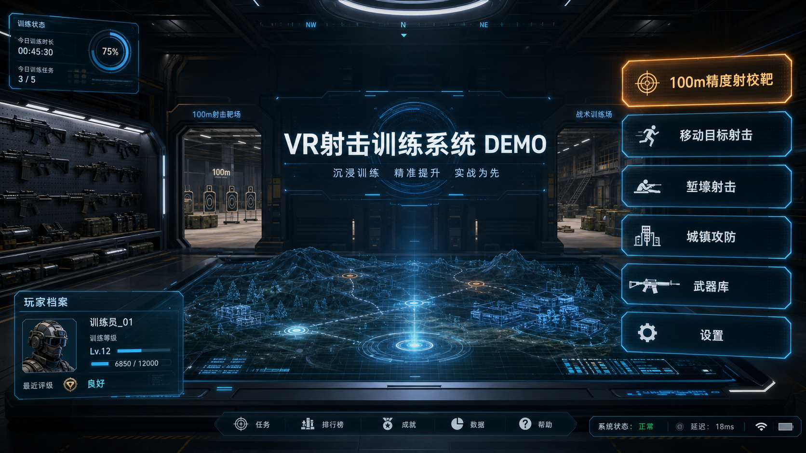

**提示词：**

```text
生成VR射击训练游戏主界面UI图，16:9横版。背景是未来感军事训练基地大厅，前方有全息任务台、武器墙和远处靶场入口。画面中央显示游戏标题“VR射击训练系统 DEMO”。右侧竖向主菜单按钮：100m精度射校靶、移动目标射击、堑壕射击、城镇攻防、武器库、设置。左下角显示玩家档案、训练等级、最近评级。整体为现代军事VR训练模拟器风格，深灰黑+青蓝HUD+橙色重点提示，不要血腥，不要水印。
```

## 3. 训练模式选择

**图片名称：** `vr-shooting-training-mode-selection-ui.png`

**内容简述：** 全息沙盘指挥室中的四张训练模式卡片，展示 100m射校靶、移动目标、堑壕、城镇攻防四类训练入口。

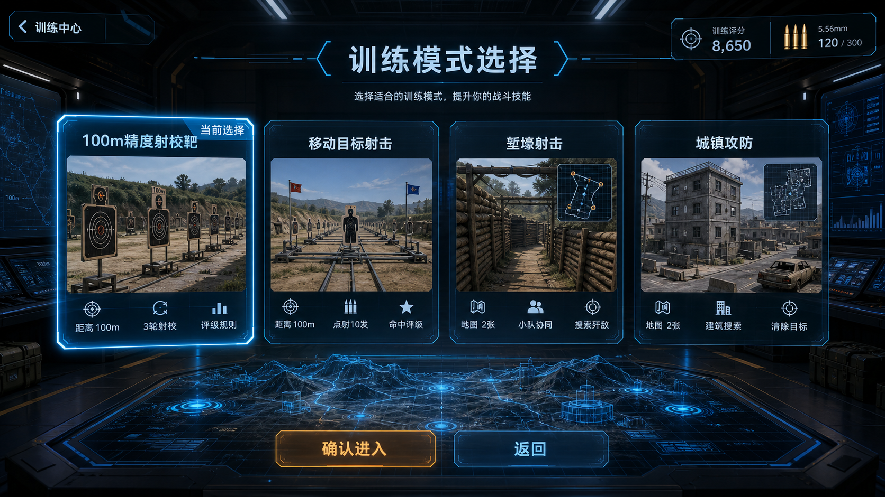

**提示词：**

```text
生成VR射击游戏“训练模式选择”界面UI图，16:9横版。背景是全息沙盘指挥室，中央悬浮四张任务卡片：100m精度射校靶、移动目标射击、堑壕射击、城镇攻防。每张卡片包含小型场景预览图、训练距离/地图数量/评级规则简短信息，当前选中卡片有青蓝色发光边框。底部有“确认进入”“返回”按钮。UI清晰、专业、现代军事训练系统风格。
```

## 4. 100m射校靶任务说明

**图片名称：** `vr-shooting-100m-zeroing-briefing-ui.png`

**内容简述：** 100m 室外靶场任务说明页，左侧显示训练参数，右侧显示 50cm×50cm 胸靶和中心 10 环示意。

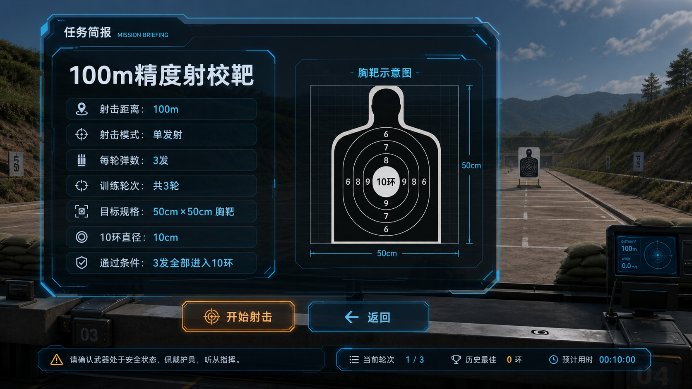

**提示词：**

```text
生成“100m精度射校靶”任务说明UI图，16:9横版。背景是100米室外靶场，远处有标准胸靶。前景为半透明全息任务面板，显示：射击距离100m、单发射、每轮3发、共3轮、目标为50cm×50cm胸靶、10环直径10cm、通过条件为3发全部进入10环。右侧显示胸靶示意图，中心白色10环明显。底部按钮：开始射击、返回。风格为VR军事训练模拟器HUD。
```

## 5. 100m射校靶第一人称射击 HUD

**图片名称：** `vr-shooting-100m-zeroing-first-person-hud-ui.png`

**内容简述：** 第一人称机械瞄具视角，远处胸靶居中，HUD 显示当前轮次、弹数、距离、稳定度和右侧弹着记录面板。

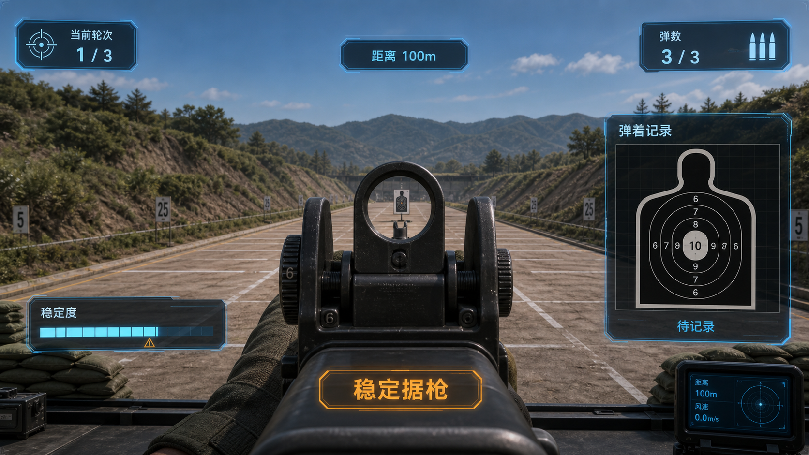

**提示词：**

```text
生成VR第一人称100m射校靶射击视角UI图，16:9横版。玩家通过机械瞄具观察远处胸靶，画面中心有准星柱和觇孔结构，枪械轻微晃动的感觉。HUD显示：当前轮次1/3、弹数3/3、距离100m、风格化稳定度条、射击提示“稳定据枪”。右侧有小型弹着记录面板，靶纸区域为空待记录。整体真实、克制、训练模拟器风格，不要夸张爆炸。
```

## 6. 100m射校靶本轮弹着分析

**图片名称：** `vr-shooting-100m-impact-analysis-ui.png`

**内容简述：** 弹着分析弹窗，左侧胸靶显示 3 个偏离中心的弹着点，右侧给出垂直/水平偏差和准星柱、觇孔调整建议。

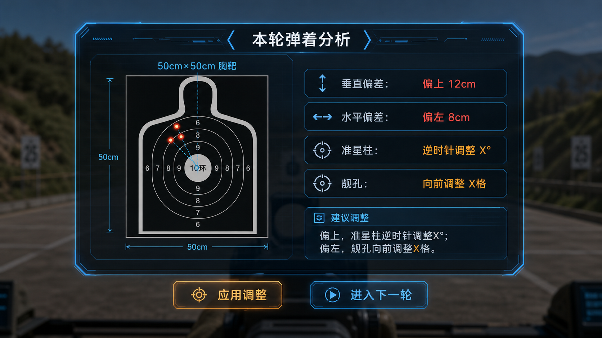

**提示词：**

```text
生成100m射校靶“本轮弹着分析”UI图，16:9横版。背景虚化为靶场射击视角，前景显示半透明分析弹窗。弹窗左侧是50cm×50cm胸靶示意图，中心白色10环，显示3个弹着点集中偏离中心。右侧显示数据：垂直偏差、水平偏差、准星柱调整方向和角度、觇孔调整方向和格数。示例文案：偏上，准星柱逆时针调整X°；偏左，觇孔向前调整X格。底部按钮：应用调整、进入下一轮。科技HUD风格，信息层级清晰。
```

## 7. 100m射校靶最终评级

**图片名称：** `vr-shooting-100m-final-rating-ui.png`

**内容简述：** 100m 射校训练结算页，中央显示评级，旁边展示三轮射击记录、弹着缩略图和通过条件。

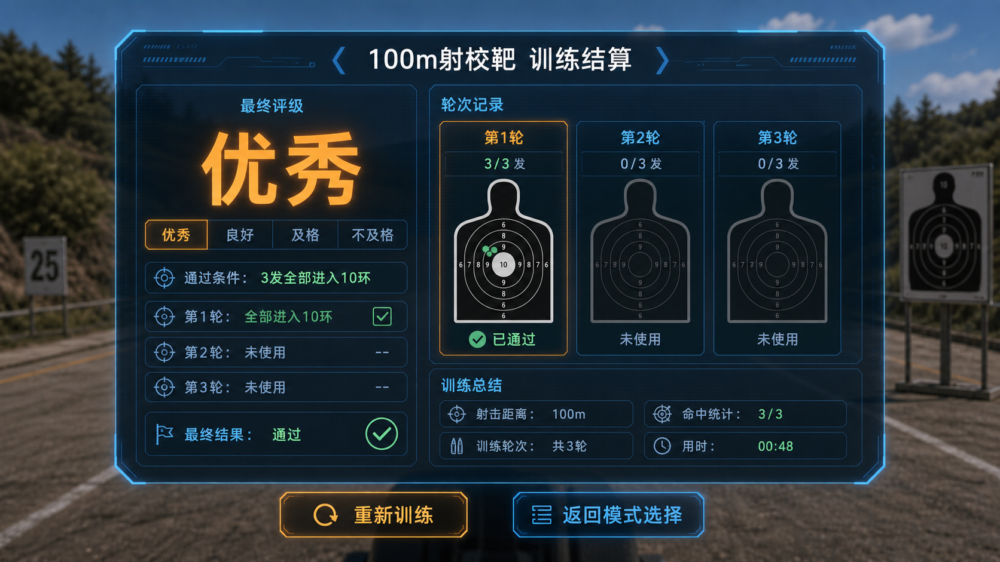

**提示词：**

```text
生成100m射校靶最终评级UI图，16:9横版。背景为靶场和胸靶，前景显示训练结算面板。中央大字显示评级“优秀/良好/及格/不及格”，旁边显示三轮射击记录、每轮弹着分布缩略图、是否进入10环、最终通过条件。底部按钮：重新训练、返回模式选择。风格专业、现代军事训练系统，青蓝色HUD和橙色评级强调。
```

## 8. 移动目标射击模式设置

**图片名称：** `vr-shooting-moving-target-mode-settings-ui.png`

**内容简述：** 移动目标训练前设置页，包含昼夜模式选择、目标速度选择、侧身跑步靶预览和“右→左→右”路线示意。

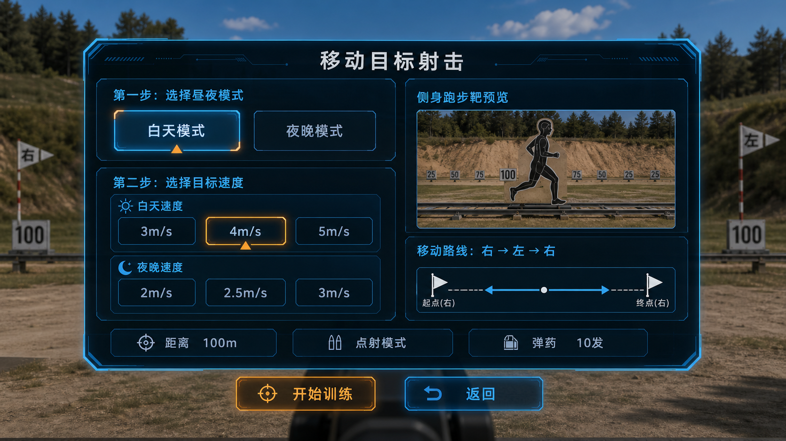

**提示词：**

```text
生成“移动目标射击”模式设置UI图，16:9横版。背景是100m移动靶训练场，两端有地图插旗标识。前景是两步式选择面板：第一步选择昼夜模式，两个大按钮“白天模式”“夜晚模式”；第二步选择目标速度，白天速度为3m/s、4m/s、5m/s，夜晚速度为2m/s、2.5m/s、3m/s。右侧显示侧身跑步靶预览和移动路线示意：右→左→右。底部按钮：开始训练、返回。
```

## 9. 移动目标射击白天 HUD

**图片名称：** `vr-shooting-moving-target-daytime-first-person-hud-ui.png`

**内容简述：** 白天 100m 移动靶第一人称射击视角，通过机械瞄具观察侧身跑步靶，HUD 展示弹药、命中、速度、方向和点射节奏。

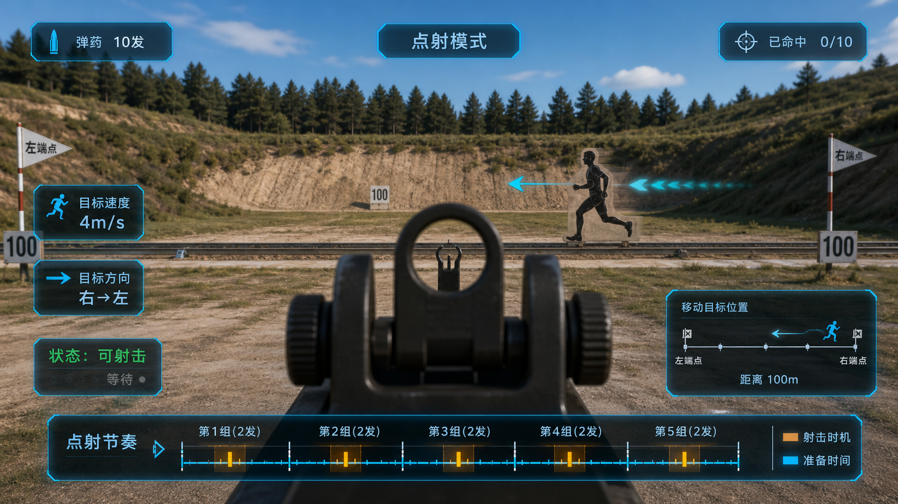

**提示词：**

```text
生成VR第一人称移动目标射击白天模式HUD图，16:9横版。背景是100m靶场，侧身跑步靶正在从右向左水平移动，左右端点有插旗标识。玩家使用觇孔瞄准，画面中心有机械瞄具。HUD显示：弹药10发、点射模式、已命中0/10、目标速度4m/s、目标方向右→左、等待/可射击状态提示。底部有节奏化点射提示条。真实训练模拟器风格。
```

## 10. 移动目标射击夜晚 HUD

**图片名称：** `vr-shooting-moving-target-night-first-person-hud-ui.png`

**内容简述：** 夜晚低照度靶场，通过绿色微光瞄准镜观察移动靶，HUD 保持青蓝色，并显示端点停留禁止射击提示。

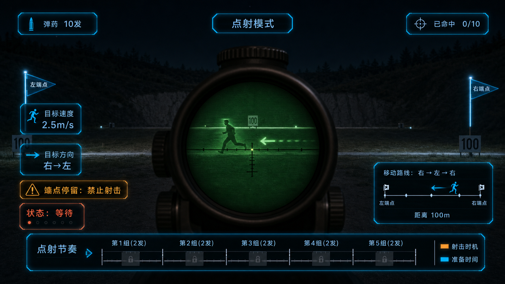

**提示词：**

```text
生成VR第一人称移动目标射击夜晚模式HUD图，16:9横版。背景为夜间100m靶场，低照度环境，玩家通过微光瞄准镜观察侧身跑步靶，画面带绿色微光夜视效果但UI仍为青蓝HUD。HUD显示：弹药10发、点射模式、已命中、目标速度2.5m/s、目标方向、端点停留禁止射击提示。左右端点有发光插旗标识。整体清晰、冷静、专业。
```

## 11. 移动目标射击训练结算

**图片名称：** `vr-shooting-moving-target-results-ui.png`

**内容简述：** 移动目标训练结果页，显示命中数量、弹药消耗、五次点射记录、评级规则和右侧移动路线命中时间点。

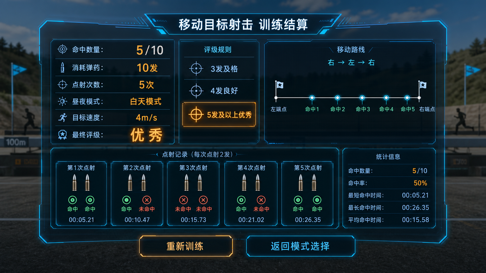

**提示词：**

```text
生成移动目标射击训练结算UI图，16:9横版。背景是移动靶场，前景为半透明结算面板。显示命中数量、消耗弹药10发、5次点射记录、昼夜模式、目标速度、最终评级：3发及格、4发良好、5发及以上优秀。右侧显示移动路线和命中时间点标记。底部按钮：重新训练、返回模式选择。现代军事VR训练HUD风格。
```

## 12. 堑壕射击地图选择

**图片名称：** `vr-shooting-trench-map-selection-ui.png`

**内容简述：** 堑壕模式地图选择界面，两张堑壕地图卡片展示俯视路线、复杂度、敌人数量范围和任务条件。

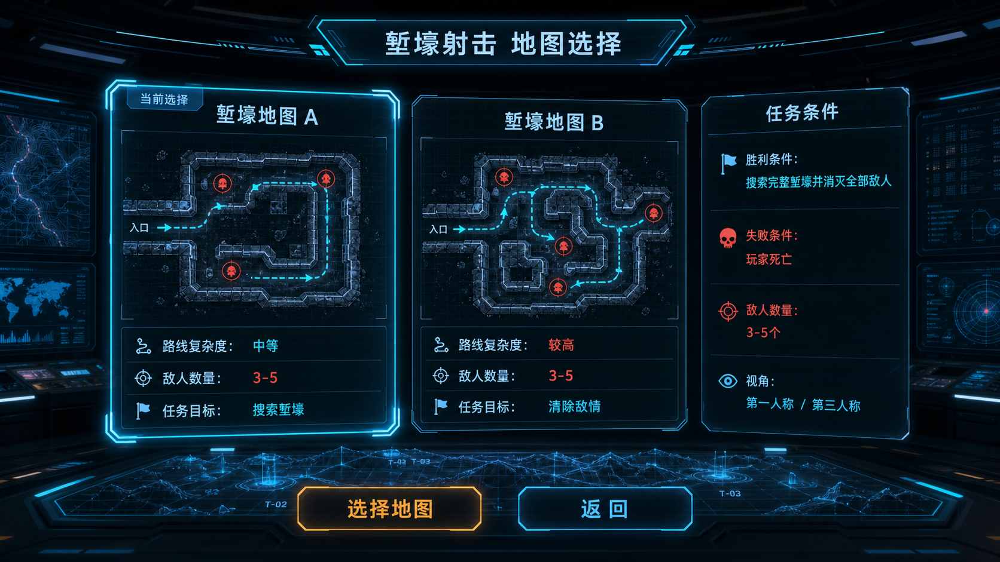

**提示词：**

```text
生成“堑壕射击”地图选择UI图，16:9横版。背景是军事战术指挥屏幕，中央显示两张堑壕地图卡片，每张卡片有俯视平面图、路线复杂度、敌人数量范围3-5、任务目标。右侧显示任务条件：搜索完整堑壕并消灭全部敌人，失败条件玩家死亡。底部按钮：选择地图、返回。界面像VR战术训练系统，青蓝全息地图线框，敌人位置用红色标记。
```

## 13. 武器库 / 武器墙

**图片名称：** `vr-shooting-armory-weapon-wall-ui.png`

**内容简述：** 训练基地武器墙界面，展示四把可选武器，选中武器有青蓝色轮廓高亮，右侧显示武器属性。

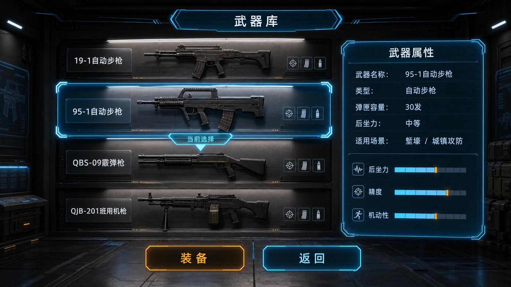

**提示词：**

```text
生成VR射击游戏武器库UI图，16:9横版。背景是训练基地武器墙，墙上陈列四把武器：19-1自动步枪、95-1自动步枪、QBS-09霰弹枪、QJB-201班用机枪。玩家视角正对武器墙，选中的武器有青蓝色轮廓高亮。右侧属性面板显示武器名称、类型、弹匣容量、后坐力、适用场景。底部按钮：装备、返回。风格写实、专业、无真实品牌logo。
```

## 14. 堑壕射击开场任务简报

**图片名称：** `vr-shooting-trench-opening-briefing-ui.png`

**内容简述：** 玩家站在堑壕边缘，无人机起飞并投射堑壕平面图，左侧显示小队配置，右侧显示任务目标。

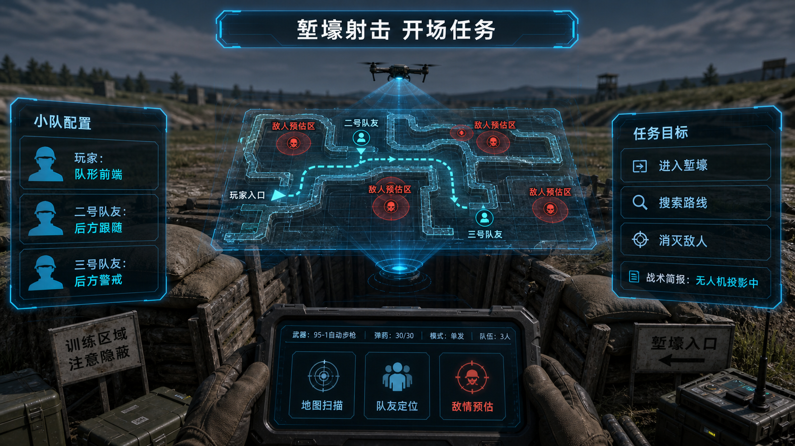

**提示词：**

```text
生成堑壕射击开场任务UI图，16:9横版。背景是玩家站在堑壕边缘，前方有无人机起飞，空中投射出堑壕平面全息地图。地图上显示玩家入口、队友位置、3-5个红色敌人预估区域。左侧显示小队配置：玩家、二号队友、三号队友。右侧显示任务目标：进入堑壕、搜索路线、消灭敌人。画面有VR战术简报感，青蓝全息投影和红色敌情标记。
```

## 15. 堑壕射击第一人称 HUD

**图片名称：** `vr-shooting-trench-first-person-hud-ui.png`

**内容简述：** 玩家位于狭窄堑壕内，前方是拐角，HUD 显示小地图、队友位置、敌人预估点、弹药和姿态/换肩状态。

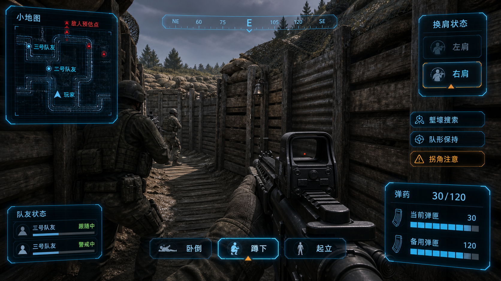

**提示词：**

```text
生成VR第一人称堑壕射击HUD图，16:9横版。玩家位于狭窄堑壕内，手持自动步枪，前方是拐角。HUD左上角显示小地图：玩家位置、两名队友位置、红色敌人预估点。右下角显示弹药30/120、当前弹匣、备用弹匣。底部显示姿态状态：卧倒、蹲下、起立；右侧显示换肩状态：左肩/右肩。画面中有队友在玩家后方保持队形。真实军事训练模拟器风格，不血腥。
```

## 16. 堑壕队友指令环形菜单

**图片名称：** `vr-shooting-trench-teammate-command-radial-ui.png`

**内容简述：** 堑壕拐角场景中弹出半透明环形队友指令菜单，当前选中“手榴弹”，同时保留小地图、弹药和队友状态。

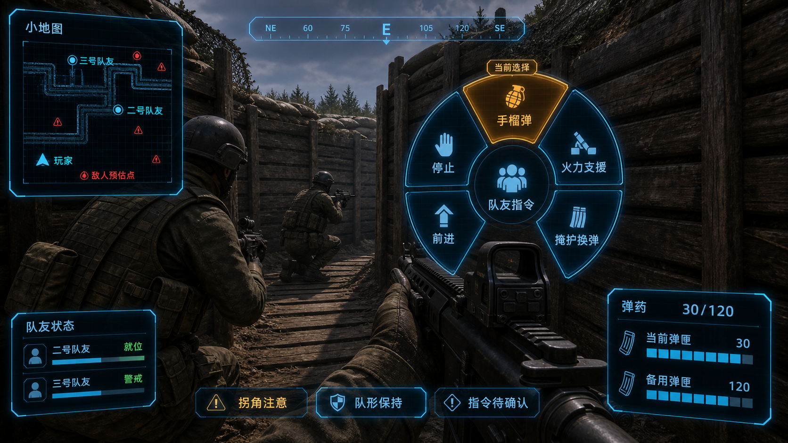

**提示词：**

```text
生成VR堑壕射击队友指令UI图，16:9横版。背景是堑壕拐角战斗场景，前景中央偏右出现半透明环形指令菜单。菜单选项包括：手榴弹、火力支援、掩护换弹、前进、停止。当前选中“手榴弹”有橙色高亮。HUD仍显示小地图、弹药30/120、队友状态。整体为VR战术指挥界面，清晰、专业、有沉浸感。
```

## 17. 堑壕射击任务结算

**图片名称：** `vr-shooting-trench-results-ui.png`

**内容简述：** 堑壕任务完成后的结算页，显示地图、击敌数量、搜索完成度、剩余弹药、队友状态和右侧堑壕平面图。

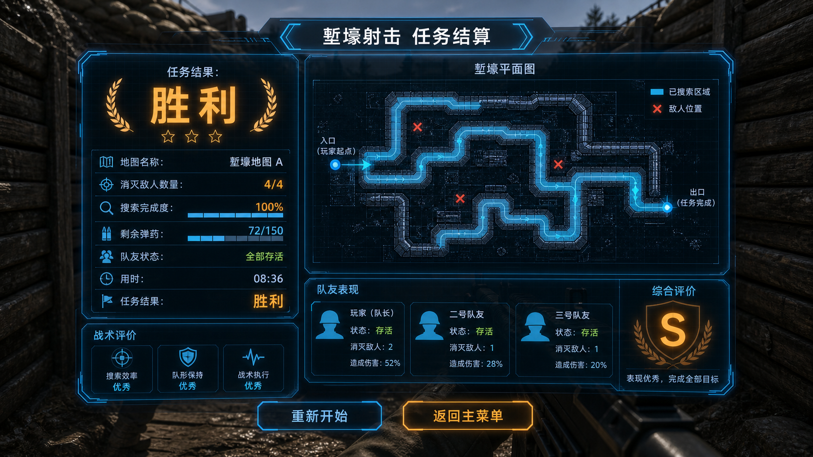

**提示词：**

```text
生成堑壕射击任务结算UI图，16:9横版。背景是完成搜索后的堑壕场景，前景显示结算面板。内容包括：地图名称、消灭敌人数量、搜索完成度、剩余弹药、队友状态、用时、任务结果“胜利/失败”。右侧显示堑壕平面图，已搜索区域用青蓝色标记，敌人位置用红色叉号标记。底部按钮：重新开始、返回主菜单。
```

## 18. 城镇攻防地图选择

**图片名称：** `vr-shooting-urban-map-selection-ui.png`

**内容简述：** 战术指挥室全息沙盘中的城镇地图选择页，两张地图卡展示街道、三层楼房、可搜索房间和敌情区域。

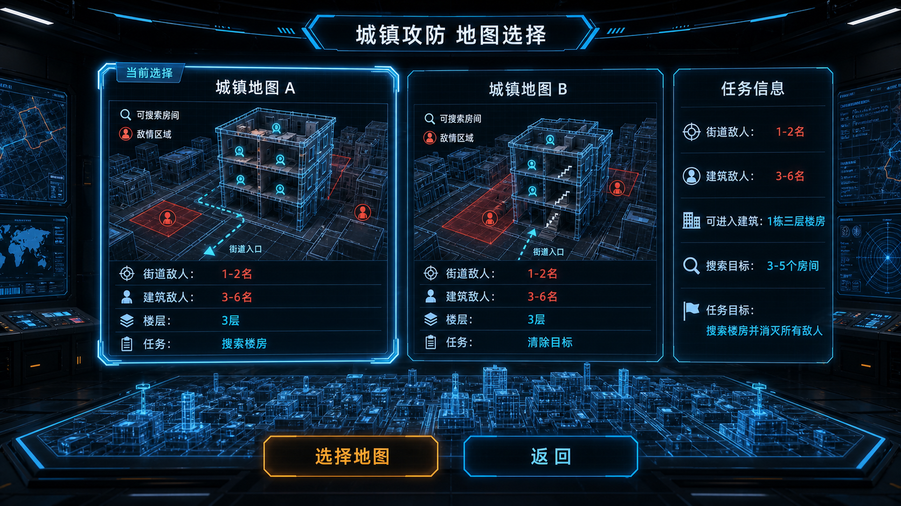

**提示词：**

```text
生成“城镇攻防”地图选择UI图，16:9横版。背景是战术指挥室全息沙盘，中央有两张城镇地图卡片。地图预览包含街道、一栋三层楼房、可搜索房间标记。右侧任务信息显示：街道敌人1-2名，建筑敌人3-6名，搜索楼房并消灭所有敌人。底部按钮：选择地图、返回。UI为现代VR军事训练系统风格，青蓝线框建筑和红色敌情区域。
```

## 19. 城镇攻防街道 HUD

**图片名称：** `vr-shooting-urban-street-first-person-hud-ui.png`

**内容简述：** 玩家进入城市街道，前方为可进入三层楼房，HUD 显示小地图、队友、建筑入口、敌情提示、弹药和姿态/换肩/拐角射击状态。

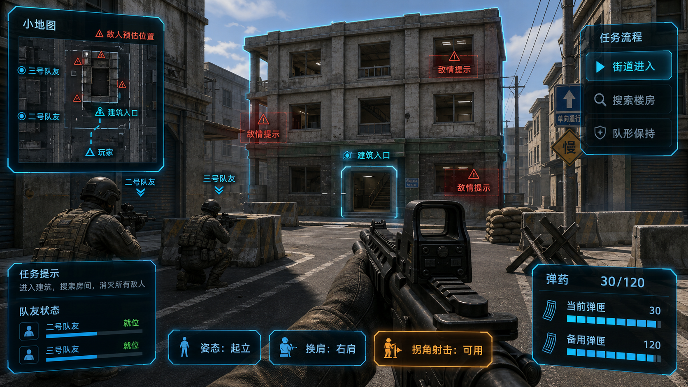

**提示词：**

```text
生成VR第一人称城镇攻防街道HUD图，16:9横版。玩家进入城市街道，手持步枪，前方是一栋可进入的三层楼房，街道上有战术掩体和敌情提示。HUD左上角小地图显示玩家、两名队友、建筑入口和红色敌人预估位置。右下角显示弹药30/120。底部显示姿态、换肩、拐角射击提示。整体写实、清晰、无血腥，像VR战术训练DEMO截图。
```

## 20. 城镇攻防建筑搜索 HUD

**图片名称：** `vr-shooting-urban-building-search-first-person-hud-ui.png`

**内容简述：** 三层楼房内部楼道拐角搜索视角，前方有房门、楼梯和危险区域提示，HUD 显示楼层小地图、房间搜索状态和交互提示。

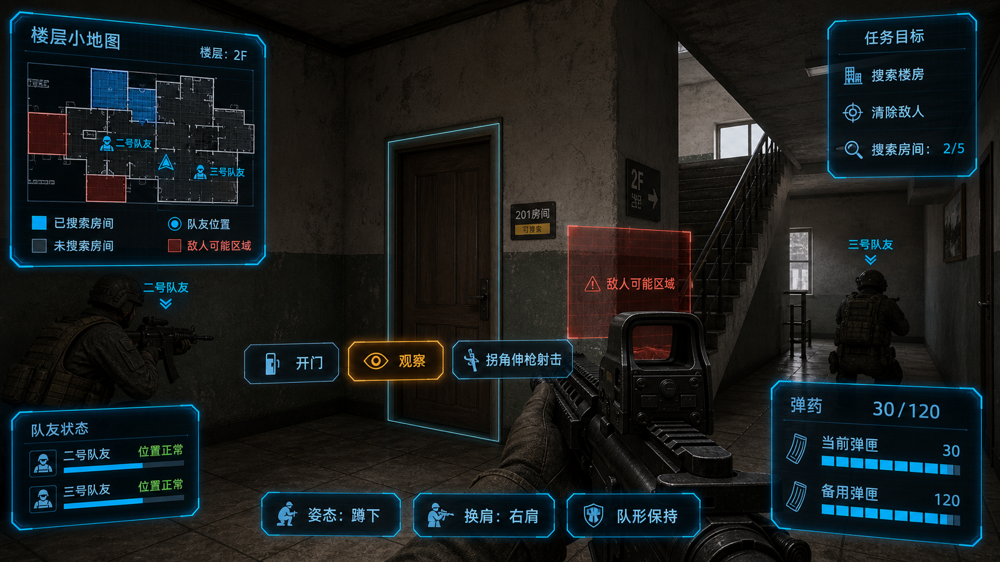

**提示词：**

```text
生成VR第一人称建筑搜索HUD图，16:9横版。玩家位于三层楼房内部楼道拐角，准备搜索房间。画面前方有房门、楼梯和拐角危险区域提示。HUD左上角显示楼层小地图，标记已搜索房间、未搜索房间、队友位置、红色敌人可能区域。右下角显示弹药30/120。中间有小型交互提示：开门、观察、拐角伸枪射击。风格为专业军事VR训练模拟器，不血腥。
```

## 21. 城镇攻防任务结算

**图片名称：** `vr-shooting-urban-results-ui.png`

**内容简述：** 城镇攻防完成后的结算页，背景为三层楼外景，前景显示任务数据，右侧为三层楼平面缩略图和敌人位置红色叉号。

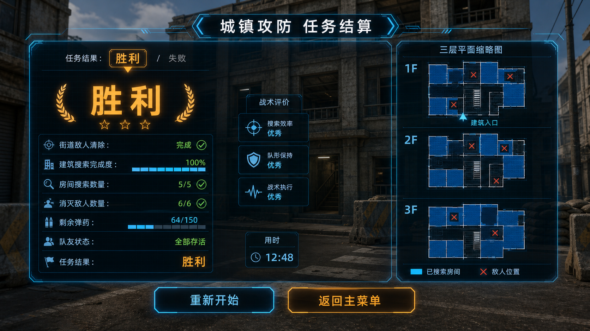

**提示词：**

```text
生成城镇攻防任务结算UI图，16:9横版。背景是任务完成后的三层楼房外景，前景为半透明结算面板。内容包括：街道敌人清除、建筑搜索完成度、房间搜索数量、消灭敌人数量、剩余弹药、队友状态、任务结果“胜利/失败”。右侧显示楼房三层平面缩略图，已搜索房间用青蓝色标记，敌人位置用红色叉号标记。底部按钮：重新开始、返回主菜单。
```

## 22. 设置界面

**图片名称：** `vr-shooting-settings-ui.png`

**内容简述：** VR 射击训练游戏设置界面，左侧为舒适度、移动、亮度、HUD、音量等设置项，右侧为 HUD 实时预览窗口。

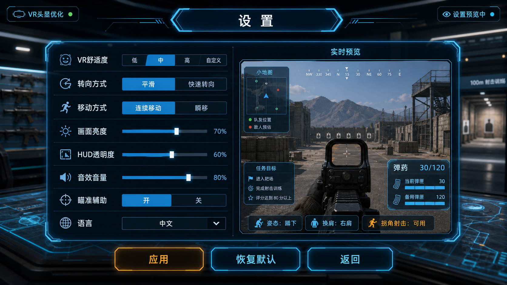

**提示词：**

```text
生成VR射击训练游戏设置界面UI图，16:9横版。背景为虚化训练基地大厅，前景是简洁半透明设置面板。设置项包括：VR舒适度、转向方式、移动方式、画面亮度、HUD透明度、音效音量、瞄准辅助、语言。右侧有实时预览窗口展示HUD效果。底部按钮：应用、恢复默认、返回。整体风格现代、清晰、适合VR头显阅读。
```

