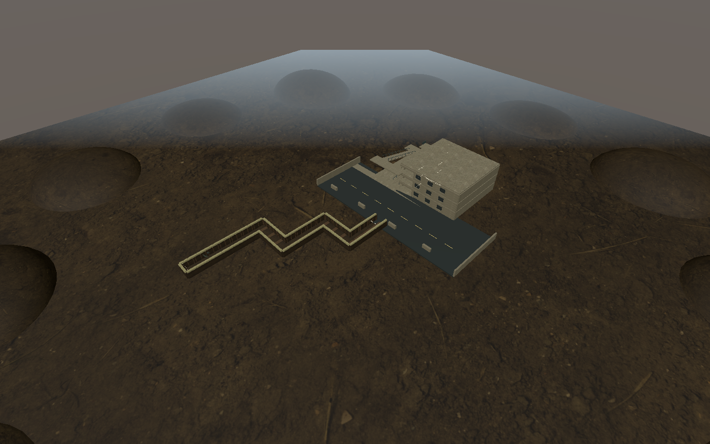
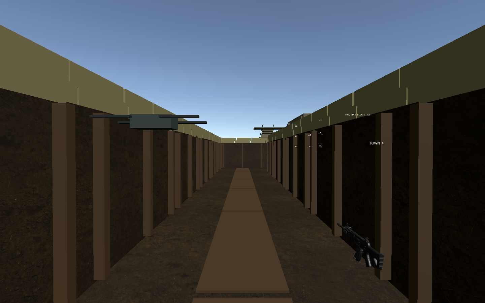
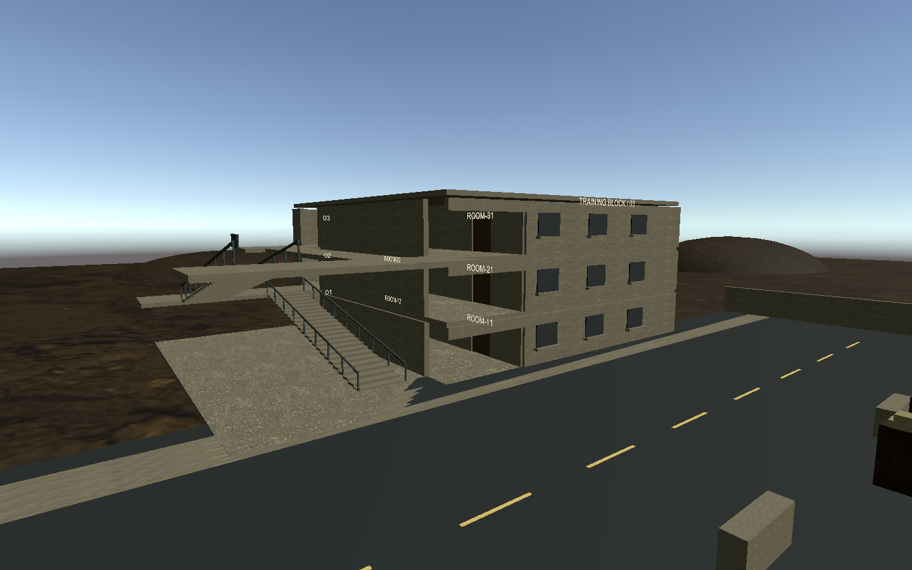

# 场景3交付：小型堑壕与城镇原型

交付日期：2026-09-10。仅实现场景负责人 task003、task006、task009、task012，不实现其他岗位的业务服务或 UI。

## 打开与运行

1. 用 Unity **2022.3.62f3c1** 打开项目。
2. 打开 `Assets/Scenes/CombatScene.unity`，点击 Play。场景已加入 Build Settings；无需运行生成器或手动改 Hierarchy。
3. 默认进入无 VR 场景巡检，沿堑壕前行，经四处拐角抵达街道。建筑位于街道北侧，入口与外侧折返楼梯连通三层，共五个房间。

| 操作 | 作用 |
|---|---|
| WASD | 带碰撞的步行巡检 |
| 按住鼠标右键拖动 | 调整视角 |
| E | 靠近并朝向门确认交互；输入事实经 Fixture 接受后驱动门 |
| 鼠标左键 | 射线命中角色后演示命中音效与死亡/尸体表现 |
| F | 演示角色枪口射击表现 |
| N | 向两名队友发送巡检导航目的地，屏幕显示到达/失败事实 |
| R | 重建本轮替身角色，复位门与玩家位置 |
| M / Tab | 显示场景平面图 / 切换街道与楼层图 |

场景默认的 `SceneInspectionFixture` 是独立场景替身：固定显示 5 个堑壕、2 个街道、6 个建筑敌人视觉实例和两名队友，便于检查最大数量与尸体生命周期。它不创建生产 Session，不计算伤害、弹药、搜索进度、队形规则或胜负。真实装配时关闭此 Fixture，再通过绑定与表现端口接入。武器复用原有 Prefab，放置于独立武器锚点；场景替身不启用其真实武器业务。

有运行中的 XR Display 时，现有模式控制器自动使用 XR Origin；没有设备时使用无 VR 相机。保留 HMD/手柄跟踪与独立锚点，场景不擅自定义 P3 摇杆移动策略，生产移动策略由玩法线接入。实机操作尚未验收。

## 逐任务核对

| 任务 | 已交付场景内容 | 验证证据 | 状态 |
|---|---|---|---|
| task003 | 4m 堑壕通道、8 搜索节点、5 候选点/预估区域、4 拐角区、玩家/两队友/武器/简报/HUD/结算/投影锚点与稳定 ID | 绑定/地图/碰撞校验、全路线导航、实际角色通行 | 实现与自测通过，待独立审核 |
| task006 | 烘焙导航、角色 Prefab、感知射线源/命中体/枪口/音源、导航事实、命中事件去重、死亡停导航与尸体保留、无人机起飞/地图投影 | 路径到达/失败、墙遮挡、命中去重、重试卸载、最大角色样本 | 实现与自测通过，VR/设备性能待验 |
| task009 | 一条街、一栋三层建筑，5 房间（2+2+1）、2 街道/6 建筑候选点、入口/楼层/房间检查区、街道及三层地图 | 唯一 ID、规模断言、从堑壕逐层进入房间并返回 | 实现与自测通过，待独立审核 |
| task012 | 5 扇房门的范围/射线确认、接受输出后的开合动画/物理叶片/NavMesh 障碍、角色复用及全部复位 | 开门后通行、重复事件幂等、上下楼、尸体与场景卸载、相机互斥 | 实现与自测通过，VR/设备性能待验 |

详细保存实例坐标见 [绑定表](bindings.md)。任务目录内有四份独立交付记录。节点 A/B/C/D 未代签，任务进度保持 `[~]`；不宣称整个 P3 或真实战斗闭环已完成。

## 验证结果

- **全项目 EditMode：163/163 通过**，包括本次 2 项场景绑定测试及现有测试：[结果 XML](editmode.xml)。
- **场景3 PlayMode：9/9 通过**：[结果 XML](playmode.xml)。
- 保存场景的稳定绑定、NavMesh、节点碰撞间隙和 Missing Script 校验通过：[校验记录](bindings-validation.txt)。
- 已实际修正门向走廊开启造成“导航放行但角色仍被门叶挡住”的问题；门现在向房间内开启，CharacterController 全路线测试通过。
- 未重新运行全项目 PlayMode；本轮 PlayMode 仅为场景3专项。P1/P2 保存场景未修改。

PlayMode 覆盖：全节点双向导航；实际 CharacterController 从堑壕经过街道、五个房间及楼梯后返回；门事件去重/复位；范围与射线确认；墙体遮挡；导航失败/到达；命中去重与尸体保留；三次重试及场景重新加载；VR/无 VR 相机与 AudioListener 互斥、射击表现不改写头部姿态；最大数量的角色/尸体样本。

### 复现命令

在项目根目录执行（Unity 编辑器需释放项目占用）：

```powershell
& 'E:\2022.3.62f3c1\Editor\Unity.exe' -batchmode -projectPath 'E:\AI\project\SimulatedShooting' -runTests -testPlatform EditMode -testResults 'E:\AI\project\SimulatedShooting\Logs\Scene3\editmode.xml' -logFile 'E:\AI\project\SimulatedShooting\Logs\Scene3\editmode.log'
& 'E:\2022.3.62f3c1\Editor\Unity.exe' -batchmode -projectPath 'E:\AI\project\SimulatedShooting' -runTests -testPlatform PlayMode -testFilter SimulatedShooting.Tests.PlayMode.CombatScenePlayModeTests -testResults 'E:\AI\project\SimulatedShooting\Logs\Scene3\playmode.xml' -logFile 'E:\AI\project\SimulatedShooting\Logs\Scene3\playmode.log'
```

运行结果以 XML 为准。机器没有可用头显时，OpenXR 日志出现 `XR_ERROR_FORM_FACTOR_UNAVAILABLE`；本次无 VR 测试正常完成，不将此视为实机通过。

## 性能与尚未验证的项目

[批处理样本](performance.txt)：i7-12700H / RTX 3060 Laptop，640×480，13 个尸体和2名队友，采集180帧。记录帧间隔、GC 和托管内存；**这是批处理 Editor 样本，不能代表可见渲染帧率或 VR 性能**。GPU 帧时未取得，目标设备/刷新率尚未指定。

VR 后续步骤：在目标设备上确认移动适配后，沿同一路线往返；检查转角/楼梯舒适度、HMD 自然高度、机瞄和队友遮挡、门口交互与室内可读性；在角色及尸体密集视角持续采集 CPU/GPU/GC。记录设备、刷新率、采样时长和预算后再作性能验收。真实 UI/玩法服务联调由对应岗位执行。

角色原为有头盔、背心和武器的方块简化原型。2026-09-12 的写实化增量已将其替换为真实人体比例的 CC0 低模士兵 FBX，并加入静态持枪姿态、敌我臂章和项目内 QBC-191 视觉；它仍是适合 VR 原型的低模资源，不宣称达到照片级人物质量。城镇外墙、门窗改用已有 Poly Haven 扫描素材，堑壕补充圆角沙袋，街区补充瓦砾、油桶、屋顶女儿墙和路灯。场景玩法端口与稳定 ID 未改变。

同次修复了堑壕与城镇连接处的地面闪烁：`Street`、`Sidewalk` 和一层 `Floor_1` 原先存在重叠且顶面共面，镜头移动时会产生 Z-fighting；现在三者顶面分别错开，并增加 EditMode 回归检查。保存场景仍是权威，不需要也不应重新运行首次创建 Builder。详见 [写实化交付记录](realism-polish-2026-09-12.md)。

## 文件与资源

- 场景：`Assets/Scenes/CombatScene.unity`。
- 运行时：`Assets/SimulatedShooting/Runtime/Scene/Combat*.cs`。
- 编辑器创建/校验/导航/截图：`Assets/SimulatedShooting/Editor/CombatSceneBuilder.cs`。
- 角色：`Assets/SimulatedShooting/Prefabs/Combat/Actor_Enemy.prefab`、`Actor_Teammate.prefab`。
- 材质、地图、音效、NavMesh：`Assets/SimulatedShooting/Art/Combat/`。
- 本地表现端口：`docs/接口文档/14-P3合并场景表现绑定.md`。
- 资源来源与许可：`Assets/SimulatedShooting/Art/Combat/ATTRIBUTION.md`。复用项目内 Poly Haven CC0 泥土/混凝土贴图和原有训练步枪；其余几何、角色、图和短促命中音效在项目内生成，无新下载素材。

后续以保存场景为权威。首次创建菜单遇到已有场景会拒绝覆盖；可用 `Tools → Simulated Shooting → Scene 3` 中的独立校验、导航重烘焙和截图菜单。手工调整后不要删除保存场景来重跑生成器。

未创建 Git 提交。起始 HEAD：`5605031`。仅新增本次场景及必要代码/资源/测试/文档、追加 Build Settings 场景条目与 InputSystem 程序集引用；Unity 自动改写的无关 OpenXR 设置已恢复。

## 巡检截图






