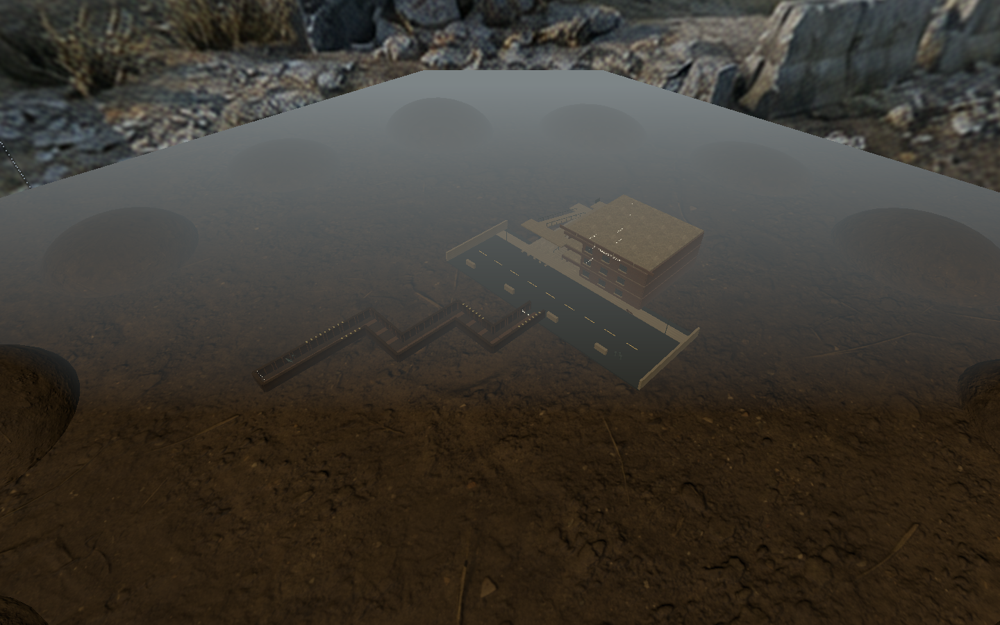
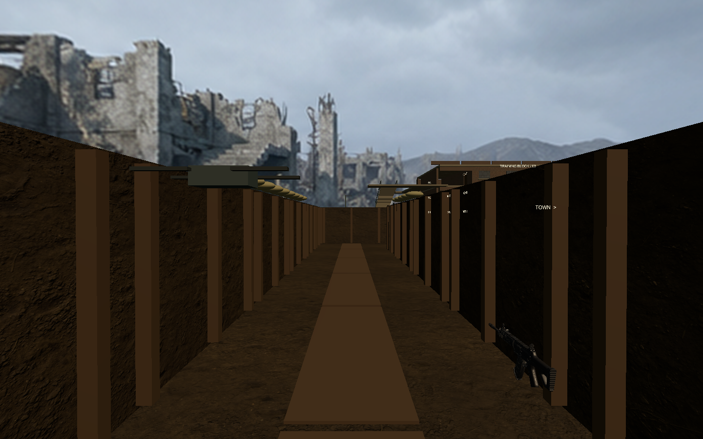
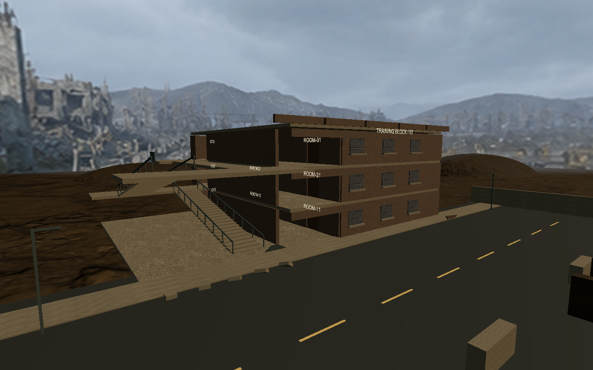
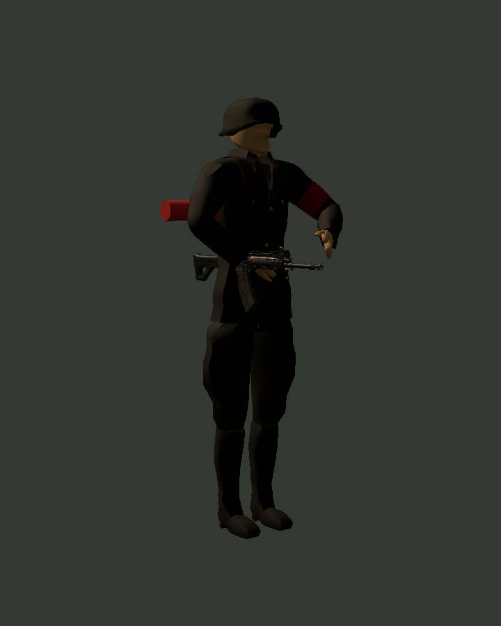

# 场景三写实化与闪烁修复

日期：2026-09-12

## 结果

- 直接增量修改 `Assets/Scenes/CombatScene.unity`，未重建或覆盖保存场景。
- 修复战壕到城镇连接区的 Z-fighting：道路、路缘和一层建筑地面原先有重叠共面顶面；现已保留碰撞与通行能力并错开可见面高度。
- 城镇外墙、门、窗改用仓库已有的 Poly Haven CC0 扫描材质；补充女儿墙、瓦砾、油桶、木托盘和路灯。
- 堑壕泥土材质启用已有扫描法线，补充圆角沙袋轮廓，并调整废墟天空、环境光和雾。
- 敌人和队友由方块角色改为 nisu 的 CC0 低模士兵 FBX；加入静态持枪姿态、敌我臂章和项目已有 QBC-191 视觉。角色仍复用原 `CombatActorView`、Collider、NavMeshAgent、命中、死亡和导航端口。

## 素材与许可

- [Rigged Lowpoly WW2 Soldier](https://opengameart.org/content/rigged-lowpoly-ww2-soldier)：作者 nisu，CC0 1.0，FBX 与贴图已随仓库保存。
- [Modular Factory Facade](https://polyhaven.com/a/modular_factory_facade)：作者 James Ray Cock，CC0 1.0，复用仓库已有 1K Unity 运行时派生贴图。
- [Poly Haven 许可](https://polyhaven.com/license)：Poly Haven 资产可用于商业项目并可再分发。
- QBC-191：复用仓库已有模型，许可记录见 `Assets/SimulatedShooting/Prefabs/Weapons/QBC-191/ATTRIBUTION.md`。

## 验证

- `CombatSceneBuilder.Validate()`：绑定、导航、碰撞间隙和 Missing Script 校验通过。
- 定向 EditMode：4/4 通过；新增连接区三个可行走表面不得共面、敌人 Prefab 必须包含导入士兵 Renderer。结果见 `realism-editmode.xml`。
- 定向 PlayMode：9/9 通过；继续覆盖全路线、房门、导航、命中/死亡、重试和相机互斥。结果见 `realism-playmode.xml`。
- VR 真实设备上的人物观感、室外照明和新增细节性能仍需实机验收；低模士兵是可商用开放素材方案，不是照片级角色终稿。

## 预览

