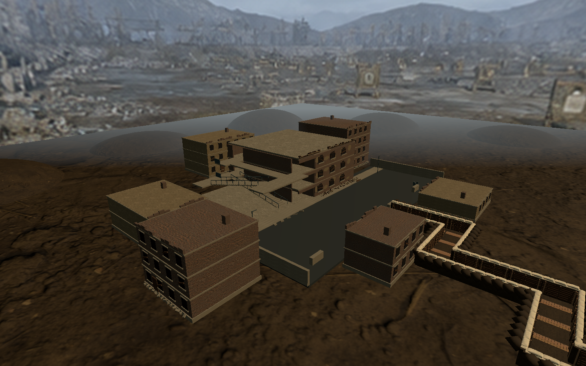

# 城镇外围建筑扩充

按用户反馈，在现有 CombatScene 中增量增加六栋封闭外围建筑，场景内共七栋楼房。包括两层排屋、一层车间、三层街角楼、两层住宅、四层公寓、后方三层楼，布置于街道两侧和原搜索楼周围。

新增建筑采用砖墙或旧灰泥、暗窗、封窗木板、不规则女儿墙、烟囱及墙脚碎砖。每栋设置一个实体 BoxCollider；没有路牌文字，也不增加室内房间或玩法搜索任务。现有三层搜索楼、战壕、房门和导航绑定保留。

范围追溯：task009 美术范围补充；BDD 19 街道与建筑入口、BDD 20 楼层与房门通行。执行入口：`Tools/Simulated Shooting/Scene 3/Add Perimeter Buildings`，对已保存场景增量更新。

## 验证

- EditMode 7/7 通过：`town-expansion-editmode.xml`，新增六栋建筑数量、实体碰撞和搜索点间隙检查。
- PlayMode 9/9 通过：`town-expansion-playmode.xml`，覆盖原战壕、街道、楼层、房门和导航回归。
- 场景绑定、导航、碰撞间隙与 Missing Script 校验通过；街区截图已检查。
- 回写前确认原有序列化对象均保持一致，唯一变化为父节点增加新建筑组的子引用；新增六个建筑碰撞体。
- VR 实机性能与观感待验。

