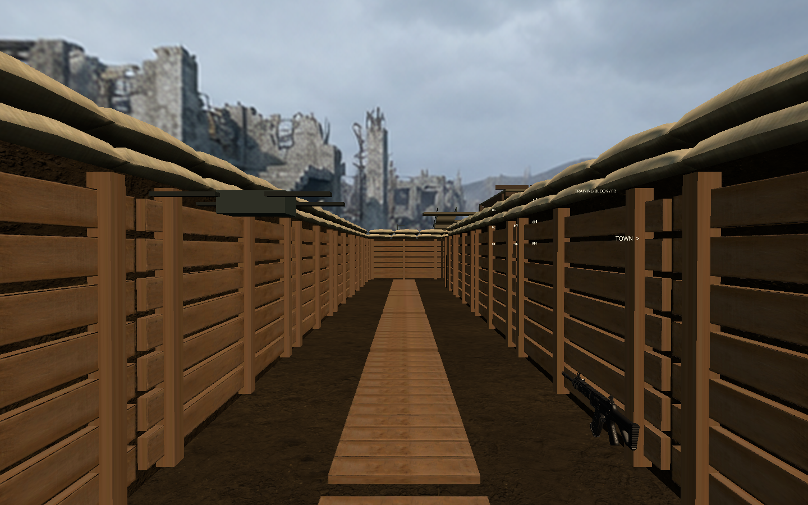

# 截图区域闪烁修正与战壕细化

## 范围与原因

在现有 `CombatScene.unity` 上增量修改，没有运行全场景 Build，没有调整角色、天空、玩法或 UI。归属 P3 场景 task003/task009；维持 BDD 15 的堑壕通行和 BDD 19 的建筑入口通行条件，以及接口 11/14 的既有绑定。

上次闪烁修复不完整：`StairBase` 顶面与 `Street` 同为 Y=0，交叠区域 X=4..16、Z=62..66；最后一块 `TrenchFloor` 在 Z=44..46 与街道共面。新增回归断言先得到 3 通过、1 失败（`Logs/Scene3/trench-red.xml`），命中截图的平台重叠。

- 平台顶面提升至 0.04m，保留碰撞并重烘导航。
- 出口地板裁短至 Z=42..44，与道路接边，不再覆盖道路。
- 原占位沙袋保留碰撞、关闭显示，按原位置替换 James White 的 OBJ 沙袋和布纹/法线；移除上次添加的椭球沙袋。原作者模型不是照片扫描，仍属于轻量网格。
- 增加护墙横板、分段踏板，木柱与板材使用 Poly Haven 老木板纹理，修正贴图纵向压缩。
- 新细节共享网格/材质且无额外碰撞，不引入运行时脚本。沙袋原始许可与署名见 `Assets/SimulatedShooting/Art/Combat/ATTRIBUTION.md`。

## 验证

- [EditMode 5/5](trench-detail-editmode.xml)：接缝几何、模型/法线、原占位隐藏、细节无碰撞、既有绑定。该轮之后仅调整沙袋视觉厚度和木纹缩放。
- [最终 PlayMode 9/9](trench-detail-playmode.xml)：现有 P3 无 VR 场景与路线回归。
- 最终导航连通、节点碰撞间隙、绑定、Missing Script 校验 PASS，见 `Logs/Scene3/bindings-validation.txt`。
- 两次增量更新均保存成功，未重建场景布局。静态截图已检查，但不等同于连续移动镜头验收；VR 帧率未测。

手工复验：打开保存后的 CombatScene，在截图的楼梯前平台—人行道—道路区域低角度左右移动、前后靠近；再沿壕沟出口进入城镇。确认没有表面交替闪烁、台阶阻挡或模型穿帮。真实 VR 复核相同路线的帧率、沙袋近看和转角遮挡。

