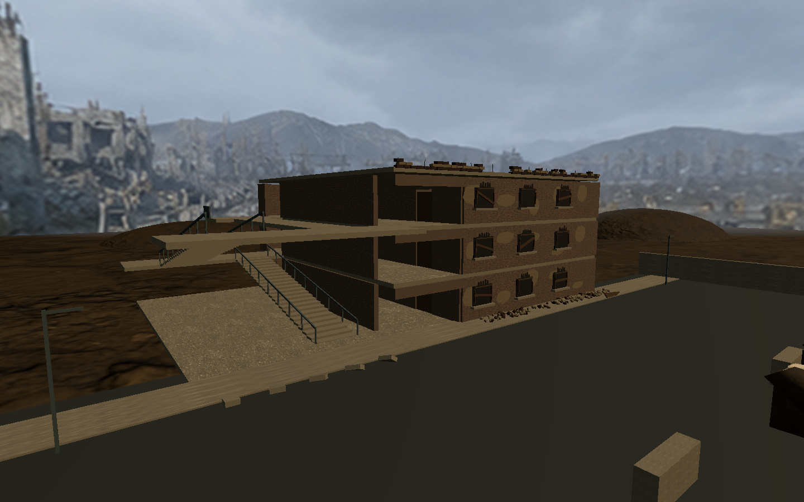
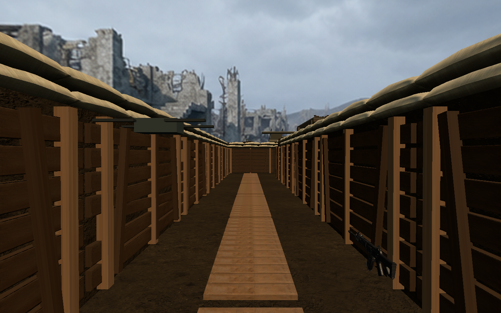

# 第三场景战损细节

本次按用户反馈增强战壕和楼房的战时观感，移除 TOWN、TRENCH、TRAINING BLOCK、ROOM 和楼层数字等场景悬空文字。HUD 和交互提示保持原有契约。

- 在保存的 CombatScene 上增量添加 `VisualPolish_Wartime`，不调用场景重建器。
- 楼房增加不规则剥落墙面、焦黑窗洞、断窗框、木板、残砖女儿墙、外露钢筋和墙脚碎砖。
- 战壕外侧增加不规则泥土堆，护壁增加倾斜木支撑；保留已有导入沙袋和木板。
- 新增细节使用固定种子和共享网格、材质，不添加碰撞体。原布局、导航数据、场景绑定、门和搜索点保持不变。
- 本次仅为 task003/task009 的场景美术调整，追溯 BDD 15 战壕通行及 BDD 19/20 建筑进入、楼层和房门交互，不改变玩法、接口或任务范围。

编辑器入口：`Tools/Simulated Shooting/Scene 3/Apply Wartime Details`。有未保存场景时拒绝执行，先保存手工调整；重复执行只替换本次新增细节根节点。

## 验证

- 隔离副本生成并检查截图后，将保存场景与新增资源回写原工程。
- 最终 EditMode：6/6 通过，见 `wartime-editmode.xml`。
- PlayMode：9/9 通过，见 `wartime-playmode.xml`；覆盖战壕、各楼层和房门通行等场景回归。此轮之后仅微调墙面颜色和无碰撞烟熏装饰，最终重新通过 EditMode 和场景校验。
- 场景绑定、导航、碰撞间隙及 Missing Script 校验通过，见 `wartime-validation.txt`。
- 回写前逐项比较原场景与更新场景：637 个 Collider 及对应 Transform 序列化内容完全一致，导航资源字节一致。
- VR 实机观感及性能未验证。本次为现有原型上的战损美术细化，楼体主体仍沿用既有结构。

